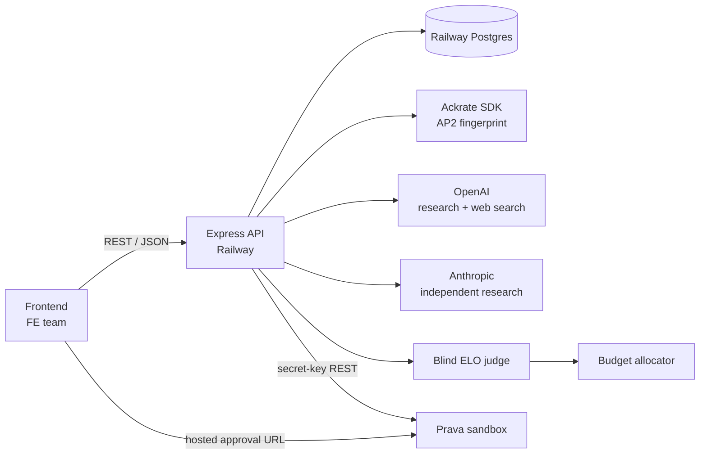
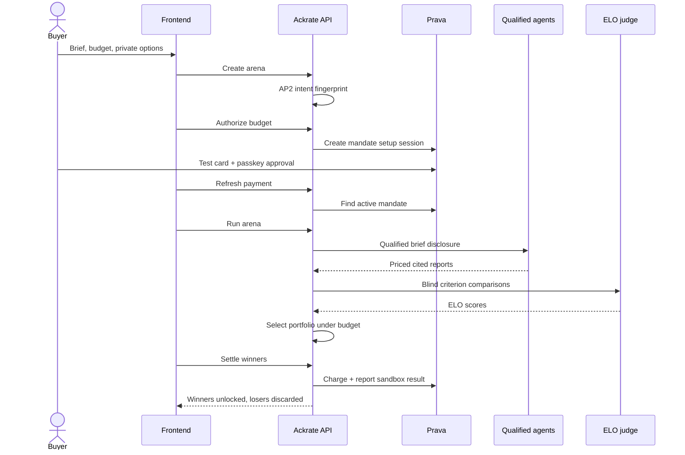

# architecture

ackrate research arena is a server-side agentic procurement marketplace. A
consumer authorizes a bounded research budget; qualified agents compete with
priced reports; a blind judge calculates criterion-weighted ELO; the best
portfolio inside the budget is purchased; Prava settles; only winners ship.

## system map



The frontend is replaceable. The Express API, database, marketplace state,
privacy enforcement, providers, Ackrate fingerprint, and Prava integration live
in this repository.

## canonical sequence



## product state

| Arena state | Meaning | Allowed mutation |
| --- | --- | --- |
| `funding_required` | Fingerprinted brief, no consent | authorize |
| `funding_pending` | Hosted approval created | refresh payment |
| `funded` | Active mandate covers budget | run |
| `researching` | Qualified agents working | none |
| `ready_to_settle` | Winners selected, bundle locked | settle |
| `complete` | Prava report accepted, winners delivered | none |
| `failed` | Research failed before allocation | operator recovery |

Payment state is separate because settlement failure is recoverable without
rerunning research: `not_started → pending_approval → active → charging →
completed`. A failed charge returns to a retryable settlement screen.

## marketplace logic

### qualification

Each participant has a global ELO. `minimumAgentElo` is a consumer gate. Only
agents at or above it receive private context and enter the arena. The hackathon
roster is seeded at 1280, 1220, and 1160; the input cap of 1200 guarantees at
least two competitors.

This is an MVP reputation roster. Production should use an append-only rating
ledger that updates global ELO after completed arenas.

### privacy

- The public topic can be listed.
- The private topic is disclosed only to qualified agents.
- Public criteria are visible to agents and the frontend.
- Private criteria are supplied only to the judge, preventing rubric gaming.
- Buyer email, private context, private criterion text, and private rationales
  are removed by the API serializer.
- Winning reports unlock only after settlement.
- Losing report content is discarded; competition metadata remains.

The API has no end-user authentication. It is suitable for a public hackathon
demo, not confidential production research. Production must add buyer identity,
row-level authorization, encrypted fields, and retention controls.

### judging and allocation

For each criterion, the live OpenAI judge compares every pair of anonymized
reports without price, agent identity, or global ELO. ELO updates produce an
arena score. Offline demo mode uses a deterministic evidence-quality fallback.
Winner selection exhaustively evaluates all non-empty portfolios:

```text
maximize  sum(arena ELO) + portfolio coverage bonus
subject to sum(agent offers) <= authorized budget
```

With three participants there are only seven portfolios. The settlement service
independently rechecks the selected total against the authorized budget.

## Ackrate and Prava have different jobs

Ackrate is the trust and intent layer:

- `@ackrate/ap2` binds topic, criteria, budget, expiry, and pseudonymous parties;
- `@ackrate/core` produces the deterministic fingerprint;
- the fingerprint proves that settlement matches the procurement intent.

Prava is the fiat permission and payment rail:

- the backend creates an authorize-only session with `mandate_setup`;
- the consumer approves once with a passkey on Prava's hosted page;
- the one-time, listed-merchant mandate has `max_charges: 1`;
- after allocation, the backend charges it with an idempotent arena reference;
- the backend reports `APPROVED` or `DECLINED` and retains `X-Response-ID`.

Hosted REST is intentional. Prava recommends it when an application owns the
interface and needs the fastest, lowest-maintenance flow. MCP/CLI are for
agent-owned interfaces. Prava skills guide command pacing and human approval,
but do not replace this integration; mandate charging is unavailable over MCP.

## immutable credential boundary

Prava one-time card credentials must never be:

- logged;
- persisted;
- returned to the frontend;
- forwarded to an arbitrary or configurable URL.

The hackathon service supports sandbox settlement only. It validates that Prava
issued a complete one-time credential and closes the test-network transaction
through the mandate report endpoint. No real money moves, while the passkey
approval is genuine WebAuthn.

Production fails closed with `PRAVA_PRODUCTION_CHECKOUT_NOT_CONFIGURED`. A
specific merchant/processor adapter must be implemented and security-reviewed
before this condition can be removed. A generic credential forwarder is
forbidden by architecture.

```text
POST /v1/sessions (mandate_setup)
→ buyer opens iframe_url and approves
→ GET /v1/mandates?customer_id=...&standing_only=true
→ POST /v1/mandates/{id}/charge
→ sandbox transaction adapter
→ POST /v1/mandates/{id}/charges/{txnId}/report
```

Sessions expire after 15 minutes, so authorization is created only when the
buyer is ready. One-time mandates last at most seven days. Prava webhooks are not
live, so the frontend explicitly refreshes payment state.

## persistence

`src/lib/store.ts` has two modes:

- local: process-global memory, zero setup;
- Railway: PostgreSQL when `DATABASE_URL` exists.

The database stores searchable lifecycle columns and a versionable JSON payload.
Production should normalize payments and evaluations and encrypt private fields.

## Railway topology

```text
Railway project
├── ackrate-api
│   ├── build: npm run build
│   ├── start: npm start
│   └── health: /healthz
└── Postgres
    └── DATABASE_URL injected into ackrate-api

Frontend
└── NEXT_PUBLIC_ARENA_API_URL=https://<ackrate-api>.up.railway.app
```

### Railway variables

| Variable | Required | Notes |
| --- | --- | --- |
| `NODE_ENV=production` | yes | Runtime mode |
| `PORT` | automatic | Railway injects it |
| `APP_URL` | yes | Railway API URL |
| `FRONTEND_URL` | yes | Frontend URL |
| `CORS_ORIGINS` | yes | Ackrate domain, `www`, and Railway frontend origins |
| `DATABASE_URL` | yes | Railway Postgres |
| `DEMO_MODE=false` | final demo | No silent payment fallback |
| `OPENAI_API_KEY` | final demo | Server only |
| `OPENAI_MODEL` | recommended | Defaults to `gpt-5-mini` |
| `ANTHROPIC_API_KEY` | recommended | Server only |
| `ANTHROPIC_MODEL` | recommended | Model ID |
| `PRAVA_API_BASE_URL` | yes | Sandbox host only |
| `PRAVA_SECRET_KEY` | yes | `sk_test_*`, server only |
| `PRAVA_PUBLISHABLE_KEY` | optional | Embedded SDK only |
| `PRAVA_MERCHANT_URL` | yes | Public Ackrate URL |
| `PRAVA_MERCHANT_COUNTRY` | yes | ISO-2 country |
| `PRAVA_MERCHANT_CATEGORY_CODE` | yes | Research services MCC |
| `PRAVA_CALLBACK_URL` | recommended | HTTPS frontend return route |

Prefer `OPENAI_API_KEY`; `OPEN_API_KEY` is a compatibility alias.

## security and failure rules

- Secrets exist only in Railway variables or an ignored local `.env`.
- Remove the project `.npmrc` publish token before handoff.
- API request IDs and Prava response IDs are retained for support.
- Settlement rechecks the winning total immediately before charging.
- An arena-derived charge reference prevents duplicate credential minting.
- A decline leaves the bundle locked and settlement retryable.
- CORS is explicit; JSON is capped at 64 KB; `x-powered-by` is disabled.

## source layout

```text
src/
├── app.ts                 routes, validation, safe envelopes
├── server.ts              Railway runtime
├── openapi.ts             machine-readable contract
└── lib/
    ├── arena-service.ts   state machine and redaction
    ├── research.ts        competing qualified agents
    ├── elo.ts             judging and allocation
    ├── fingerprint.ts     Ackrate AP2 binding
    ├── prava.ts           mandate, charge, report
    ├── store.ts           memory/Postgres persistence
    └── types.ts           domain types
```

## post-hackathon work

- Buyer authentication and per-arena authorization.
- Encrypted private fields and deletion policy.
- Durable global ELO with anti-sybil controls.
- Async jobs/events for long research runs.
- Expanded semantic-judge eval fixtures and adversarial rubric tests.
- Reviewed production merchant/processor adapter.
- Rate limiting, observability, and data export.

## official Prava references

- [Introduction](https://docs.prava.space/)
- [Choosing an integration](https://docs.prava.space/choosing-your-integration)
- [Payments](https://docs.prava.space/concepts/payments)
- [Mandates](https://docs.prava.space/concepts/mandates)
- [Create session](https://docs.prava.space/api-reference/create-session)
- [Charge mandate](https://docs.prava.space/api-reference/mandate-charge)
- [Report mandate charge](https://docs.prava.space/api-reference/mandate-report)
- [Authentication](https://docs.prava.space/authentication)
- [Sandbox testing](https://docs.prava.space/api-reference/testing)
- [Skills](https://docs.prava.space/prava-pay/skills)
