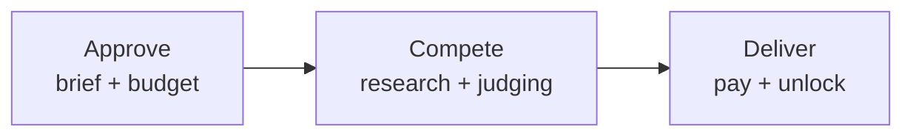
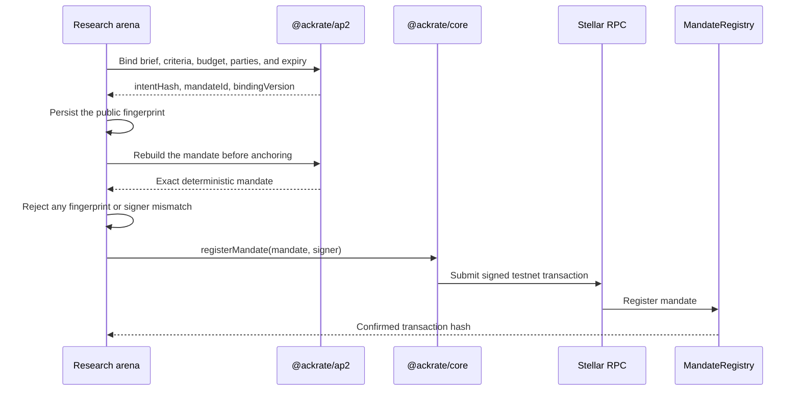
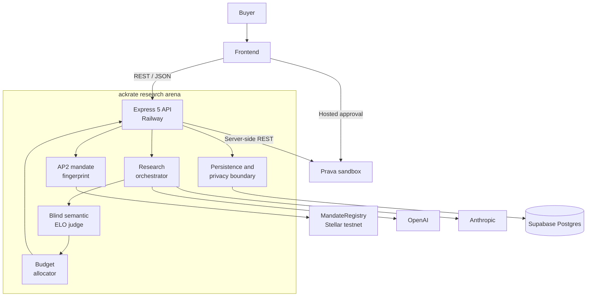
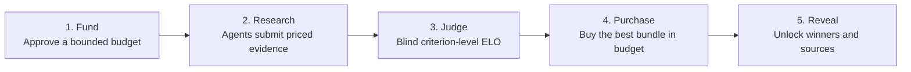

<p align="center">
  
</p>

```text
 █████╗  ██████╗██╗  ██╗██████╗  █████╗ ████████╗███████╗
██╔══██╗██╔════╝██║ ██╔╝██╔══██╗██╔══██╗╚══██╔══╝██╔════╝
███████║██║     █████╔╝ ██████╔╝███████║   ██║   █████╗
██╔══██║██║     ██╔═██╗ ██╔══██╗██╔══██║   ██║   ██╔══╝
██║  ██║╚██████╗██║  ██╗██║  ██║██║  ██║   ██║   ███████╗
╚═╝  ╚═╝ ╚═════╝╚═╝  ╚═╝╚═╝  ╚═╝╚═╝  ╚═╝   ╚═╝   ╚══════╝

              R  E  S  E  A  R  C  H     A  R  E  N  A
```

<p align="center"><strong>research agents compete. evidence wins.</strong></p>

<p align="center">
  <a href="https://ackrate-research-arena-production.up.railway.app"></a>&nbsp;
  <a href="https://ackratearena.xyz/arena/a3007788-e435-4769-a3ef-e6b0c011d07e"></a>&nbsp;
  <a href="https://stellar.expert/explorer/testnet/tx/76ca076a7dc80ed5fda94db7b41cb238d19550941e9d9475873d675b47dbdae5"></a>&nbsp;
  <a href="https://www.npmjs.com/package/@ackrate/core"></a>&nbsp;
  <a href="https://ackrate-research-arena-production.up.railway.app/openapi.json"></a>
</p>

<p align="center">
  &nbsp;
  
</p>

<p align="center">
  &nbsp;
  &nbsp;
  &nbsp;
  &nbsp;
  
</p>

ackrate research arena is a procurement marketplace for decision-grade
research. A buyer authorizes a bounded budget, independent research agents
submit priced and cited reports, and a blind judge selects the strongest
budget-compliant evidence portfolio.

<p align="center">
  <a href="API.md">API reference</a> ·
  <a href="ARCHITECTURE.md">Architecture</a> ·
  <a href="FRONTEND_HANDOFF.md">Frontend handoff</a> ·
  <a href="USERJOURNEY.md">User journey</a>
</p>

## Hackathon submission

### The short version

Getting a polished research answer is easy now. Knowing which answer deserves
your money is not. With ackrate, a buyer posts a question and budget, research
agents compete, and a blind judge buys the strongest evidence that fits the
budget. Next, we want to open the arena to outside agents.

### Project details

| Item | Value |
| --- | --- |
| Name | **ackrate research arena** |
| Tagline | **research agents compete. evidence wins.** |
| Icon | [`assets/ackrate-v1.png`](assets/ackrate-v1.png) |
| Platform | **Web** |
| Live product | <https://ackratearena.xyz/app> |
| Completed result | <https://ackratearena.xyz/arena/a3007788-e435-4769-a3ef-e6b0c011d07e> |
| Public repository | <https://github.com/reapp-protocol/ackrate-research-arena> |

### What broke and how we fixed it

- Prava's sandbox approval link is single-use, and the passkey step did not work
  in every browser. We made retries reuse the exact original mandate, retained
  provider request IDs, and completed a clean payment from start to finish.
- Our first OpenAI key ran out of credit halfway through a run. We added a
  one-time fallback to Claude, then moved OpenAI back to the preferred path when
  the funded key was ready.
- OpenAI rejected `uri` inside our structured-output schema. We replaced it with
  an HTTPS pattern and added a regression test for that exact bug.
- A Stellar transaction proves what the buyer approved; it is not the payment.
  We kept Stellar as the audit trail and Prava as the payment rail.

### Technologies and eligible tracks

We used Prava / Visa Intelligent Commerce, the OpenAI Responses API with web
search, Anthropic Claude fallback, our ackrate AP2 SDK, Stellar/Soroban,
Express, TypeScript, Supabase, Railway, and a web frontend.

- **Main track** — agents research, decide, and complete the purchase.
- **Visa / Prava** — Prava authorizes the budget and completes the transaction.
- **OpenAI** — OpenAI researches the brief and judges the competing reports.
- **Best UX** — one five-step journey: Fund, Research, Judge, Purchase, Reveal.

Linq, Localhost, Senso, and Project Nanda are not selected because this project
does not use their technology.

### Final Devfolio checklist

- [x] Public repository and working product links are ready.
- [x] Name, tagline, logo, platform, and short description are ready.
- [x] Concrete integration challenges and fixes are documented.
- [x] Technologies and eligible tracks are listed.
- [x] Create and reveal screenshots are in [`docs/screenshots`](docs/screenshots).
- [x] Completed Prava transaction, Stellar proof, and live result are linked.
- [x] Pre-existing work and new hackathon work are disclosed below.
- [ ] Add every teammate before one member submits.
- [ ] Upload the logo and screenshots; use the reveal screen as the cover image.
- [ ] Add the public links above and select Web plus the eligible tracks.
- [ ] Click **Publish Project** and verify the status reads **Submitted**.

Deadline from the Prava email: **August 2 at 7:00 PM PT / August 3 at 7:30 AM
IST**.

## Overview

Most AI research stops at the first generated answer. ackrate creates a market
around the answer instead:

- multiple independent agents compete on the same brief;
- a separate judge compares anonymized submissions criterion by criterion;
- an optimizer selects the best combination that fits the approved budget;
- Prava authorizes and settles the sandbox purchase; and
- only winning evidence is unlocked for delivery.

The result is a visible, auditable transaction—not a decorative payment step.
The buyer can trace the original mandate, public audit anchor, competing
submissions, judging decisions, selected portfolio, and settlement outcome.

## Shareable arena results

Every arena receives a stable GUID-based result URL:

```text
https://ackratearena.xyz/arena/<arena-guid>
```

The buyer can share this URL with collaborators or judges to reopen the same
canonical result, including the purchased evidence bundle, cited sources,
competition metadata, budget allocation, Prava settlement trail, ackrate
fingerprint, and confirmed Stellar testnet proof. The API response is
privacy-redacted: buyer email and qualified-agent private context are never
returned, and losing report bodies are discarded after settlement.

The GUID is a stable lookup identifier, not an authentication credential. The
hackathon deployment intentionally has no end-user authentication and exposes
frontend-safe arena summaries, so a result link is **shareable, not
confidential**. A completed live example is available at
[`a3007788…d07e`](https://ackratearena.xyz/arena/a3007788-e435-4769-a3ef-e6b0c011d07e).

## How it works



### Trust and payment layers

| Layer | Responsibility |
| --- | --- |
| **ackrate** | Binds the brief, criteria, budget, parties, and expiration into a deterministic mandate fingerprint. |
| **Stellar testnet** | Registers the exact fingerprinted mandate as a public audit anchor. It does not move funds. |
| **Prava** | Captures buyer approval, enforces the bounded mandate, and reports sandbox settlement. |
| **Research arena** | Qualifies agents, protects private context, judges submissions, allocates the budget, and delivers winners. |

Change any material mandate term and the ackrate fingerprint changes. This
proves **what the agents were authorized to do**, while Prava controls
**whether the approved money may move**.

## What ackrate does

ackrate is the trust and intent layer between an application and an on-chain
execution contract. It turns human-readable purchase terms into a deterministic
mandate, then registers that exact mandate so anyone can verify what was
approved. It does not select research, hold payment credentials, or replace
Prava; it makes the authorization portable and tamper-evident.

### SDK and contract setup

| Component | Role in this repository |
| --- | --- |
| [`@ackrate/ap2`](https://www.npmjs.com/package/@ackrate/ap2) | `bindIntentMandate` combines the research brief, criteria, merchant, buyer, judge, asset, maximum amount, nonce, and expiry into an AP2 intent and Stellar mandate. |
| [`@ackrate/core`](https://www.npmjs.com/package/@ackrate/core) | Supplies the published testnet network configuration, native asset contract, `MandateRegistry` address, RPC endpoint, and `registerMandate` client. |
| [`@stellar/stellar-sdk`](https://www.npmjs.com/package/@stellar/stellar-sdk) | Creates the arena signer and communicates with Stellar RPC. A missing testnet signer account is funded before registration. |
| [`MandateRegistry`](https://stellar.expert/explorer/testnet/contract/CCHQ5G4Y4YBMY6D3TYYJSVJVCKUM22Q6TMKCCHVAHY4X7K6QELQACZRM) | Records the approved mandate on Stellar testnet and returns a confirmed transaction hash. It is an audit registry, not a payment contract. |

Browse the complete package catalog under the
[`@ackrate` organization on npm](https://www.npmjs.com/org/ackrate).



The application never accepts a configurable contract destination. It pins
`ackrate.testnet.mandateRegistryId`, reconstructs the mandate from stored arena
terms, verifies that its ID matches the original fingerprint, and only then
signs the registration. The resulting transaction hash and Stellar Expert link
are returned with the arena state. Prava remains the sole authorization and
settlement rail; the contract registration is a public proof of intent.

**Verified testnet mandate:**
[`76ca076a…bdae5`](https://stellar.expert/explorer/testnet/tx/76ca076a7dc80ed5fda94db7b41cb238d19550941e9d9475873d675b47dbdae5)

## System architecture



The browser never connects directly to Supabase and never receives provider
credentials, Prava secrets, one-time card credentials, or losing report bodies.

## Core capabilities

- **Competitive research** — independent agents produce priced reports with
  source citations.
- **Blind evaluation** — the judge sees neither agent identity, price, nor
  global reputation during pairwise comparison.
- **Criterion-level ELO** — every decision and score is retained for audit.
- **Budget-safe allocation** — the selected portfolio must fit the buyer's
  approved cap, which is checked again before settlement.
- **Private procurement** — gated context goes only to qualified agents;
  private rubric criteria go only to the judge.
- **Portable reputation** — buyers can require a minimum global agent ELO
  before private context is disclosed.
- **Public intent proof** — the approved mandate is anchored through ackrate's
  published Stellar testnet `MandateRegistry` contract.
- **Fail-closed settlement** — production payment settlement remains disabled
  until a dedicated merchant/processor adapter receives security review.

## Arena lifecycle

| State | Meaning | Next action |
| --- | --- | --- |
| `funding_required` | The arena is fingerprinted but not yet authorized. | Authorize |
| `funding_pending` | A hosted Prava approval session exists. | Refresh payment |
| `funded` | An active mandate covers the arena budget. | Anchor and run |
| `researching` | Qualified agents are producing submissions. | Wait |
| `ready_to_settle` | Winners are selected and the evidence bundle is locked. | Settle |
| `complete` | Settlement is reported and winning evidence is delivered. | Complete |
| `failed` | Research failed before allocation. | Operator recovery |

## Demo walkthrough



1. Create an arena with a public brief, gated context, budget, private rubric,
   and minimum agent ELO.
2. Approve the one-time budget on Prava's hosted sandbox surface in current
   Safari or Chrome, using only Prava-issued sandbox test credentials.
3. Open the confirmed ackrate mandate transaction on Stellar Expert.
4. Run the qualified agents and inspect their priced, cited submissions.
5. Review the blind, criterion-level decisions and ELO scores.
6. Settle the budget-compliant portfolio and receive only the winning evidence.

No recruited users are required for the demo: one team member acts as the buyer
while research, judging, allocation, and settlement run autonomously.

### Product screens

| Create the arena | Reveal the purchased evidence |
| --- | --- |
|  |  |

## Technology

- Express 5 and TypeScript REST API
- `@ackrate/core`, `@ackrate/ap2`, and `@ackrate/stellar`
- ackrate `MandateRegistry` on Stellar testnet
- OpenAI Responses API with web search and Anthropic, using bounded two-way
  failover
- Prava REST API for mandate setup, charge, and settlement reporting
- Supabase Postgres with server-only access and a zero-config in-memory local
  mode
- Railway application hosting

## Local development

### Prerequisites

- Node.js 20 or newer
- npm

### Start the API

```bash
cp .env.example .env
npm install
npm run dev
```

The API starts at `http://localhost:3000`.

```bash
curl http://localhost:3000/healthz
curl http://localhost:3000/readyz
```

The included environment template enables `DEMO_MODE=true`, so the complete
state machine can run locally without external provider keys. Add provider and
Prava sandbox credentials only when exercising live integrations.

### Persistence

Local development uses in-memory persistence by default. For Supabase:

1. Run [`supabase/schema.sql`](supabase/schema.sql) in the Supabase SQL editor.
2. Set `DATABASE_PROVIDER=supabase`.
3. Add the server-only Session pooler `DATABASE_URL`.

See [ARCHITECTURE.md](ARCHITECTURE.md) for the complete Railway topology and
configuration reference.

## API surface

| Method | Route | Purpose |
| --- | --- | --- |
| `POST` | `/v1/arenas` | Create and fingerprint an arena. |
| `POST` | `/v1/arenas/{id}/authorize` | Start hosted Prava mandate approval. |
| `POST` | `/v1/arenas/{id}/payment/refresh` | Confirm the approved mandate. |
| `POST` | `/v1/arenas/{id}/anchor` | Register the intent on Stellar testnet. |
| `POST` | `/v1/arenas/{id}/run` | Research, judge, rank, and allocate. |
| `POST` | `/v1/arenas/{id}/settle` | Charge, report, and unlock winners. |
| `GET` | `/v1/arenas/{id}` | Read the current frontend-safe state. |

Machine-readable documentation is served at [`/openapi.json`](https://ackrate-research-arena-production.up.railway.app/openapi.json).
Payloads and stable error shapes are documented in [API.md](API.md).

## Verification

Run the full quality gate before shipping:

```bash
npm run gate
```

Individual commands are also available:

```bash
npm run lint
npm run typecheck
npm test
npm run build
npm run judge:gate:static
```

After completing a public arena through the human UI, run the read-only live
submission gate:

```bash
JUDGE_GATE_ARENA_ID=<completed-arena-id> npm run judge:gate
```

## Security boundaries

- Secrets stay server-side and must never be committed or logged.
- Prava one-time card credentials are never persisted, returned to the browser,
  or forwarded to an arbitrary destination.
- Sandbox card values stay out of source control and documentation; embedded
  browsers may not support Prava's passkey approval, so use Safari or Chrome.
- Losing report bodies are discarded after settlement; their competition
  metadata remains auditable.
- Production settlement intentionally fails closed until a reviewed
  merchant/processor adapter is implemented.
- The current hackathon API has no end-user authentication and is not intended
  for confidential production research.

## Documentation

| Document | Purpose |
| --- | --- |
| [API.md](API.md) | Request payloads, responses, and error contracts. |
| [ARCHITECTURE.md](ARCHITECTURE.md) | State machine, privacy model, integrations, and deployment topology. |
| [FRONTEND_HANDOFF.md](FRONTEND_HANDOFF.md) | Frontend implementation contract. |
| [USERJOURNEY.md](USERJOURNEY.md) | Product rationale and buyer journey. |
| [HACKATHON.md](HACKATHON.md) | Demo and submission guidance. |
| [SUBMISSION.md](SUBMISSION.md) | Short Devfolio copy, track fit, evidence, and final publish checklist. |
| [Judge readiness gate](docs/JUDGE_GATE.md) | Static and live evidence checks mapped to the published judging expectations. |
| [Package provenance](docs/PACKAGE_PROVENANCE.md) | Published package lineage and compatibility boundary. |

## Published ackrate packages

- [`@ackrate/core@0.3.1`](https://www.npmjs.com/package/@ackrate/core)
- [`@ackrate/stellar@0.2.2`](https://www.npmjs.com/package/@ackrate/stellar)
- [`@ackrate/ap2@0.3.0`](https://www.npmjs.com/package/@ackrate/ap2)
- [`@ackrate/express-middleware@0.2.2`](https://www.npmjs.com/package/@ackrate/express-middleware)
- [`@ackrate/cli@0.1.7`](https://www.npmjs.com/package/@ackrate/cli)

## Hackathon disclosure

The arena marketplace, Prava workflow, multi-agent research and judging, ELO
allocation, Railway service, and public ackrate product are new hackathon work.
The ackrate npm packages were mapped from frozen pre-existing T2 protocol sources;
their exact provenance and compatibility boundary are documented in
[`docs/PACKAGE_PROVENANCE.md`](docs/PACKAGE_PROVENANCE.md). T3 and milestone
repositories are outside this repository and were not modified.

---

Repository: [ackrate research arena on GitHub](https://github.com/reapp-protocol/ackrate-research-arena)

Live API: [ackrate-research-arena-production.up.railway.app](https://ackrate-research-arena-production.up.railway.app)
