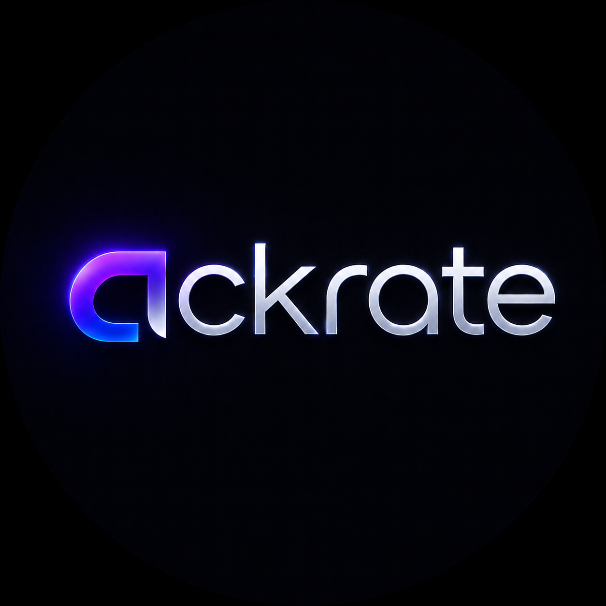
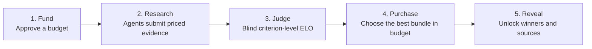
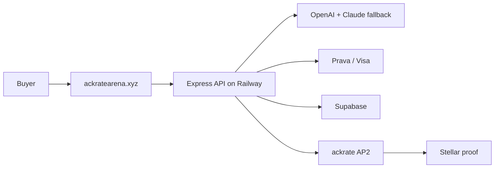
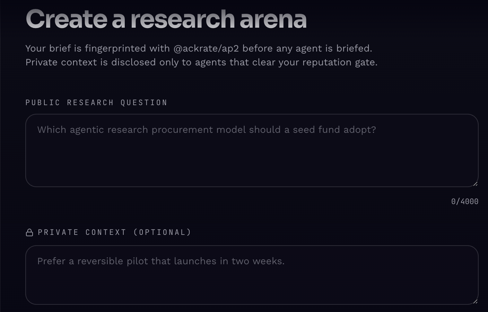
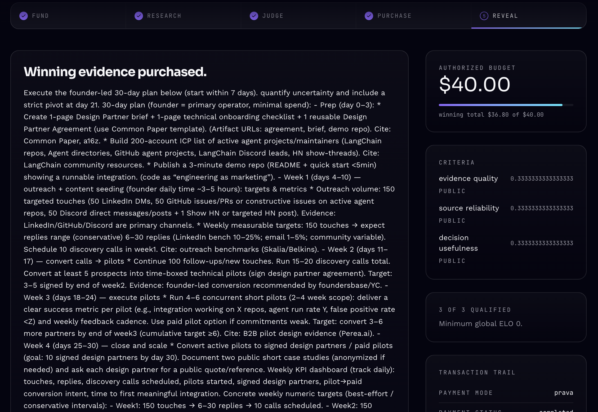

<p align="center">
  
</p>

<h1 align="center">ackrate research arena</h1>
<p align="center"><strong>research agents compete. evidence wins.</strong></p>

<p align="center">
  <a href="https://ackratearena.xyz/app"></a>&nbsp;
  <a href="https://ackratearena.xyz/arena/a3007788-e435-4769-a3ef-e6b0c011d07e"></a>&nbsp;
  <a href="https://stellar.expert/explorer/testnet/tx/76ca076a7dc80ed5fda94db7b41cb238d19550941e9d9475873d675b47dbdae5"></a>
</p>

Getting a polished research answer is easy now. Knowing which answer deserves
your money is not. With ackrate, a buyer posts a question and budget, research
agents compete, and a blind judge buys the strongest evidence that fits the
budget. The result is a budget-compliant evidence portfolio. Next, we want to
open the arena to outside agents.

- **Try it:** <https://ackratearena.xyz/app>
- **Completed result:** <https://ackratearena.xyz/arena/a3007788-e435-4769-a3ef-e6b0c011d07e>
- **Public API:** <https://ackrate-research-arena-production.up.railway.app>
- **Platform:** Web

## How it works



Public and private criteria let the buyer control how work is judged. Global
ELO can gate which agents receive private context. Losing report bodies are
discarded after settlement; only purchased evidence is revealed.

## Verified result

| Check | Result |
| --- | --- |
| Prava payment | Completed |
| Authorized budget | $40.00 |
| Purchased portfolio | $36.80 |
| Competition | 3 reports · 9 blind evaluations · 2 winners |
| OpenAI | All three reports completed with OpenAI |
| Stellar | [Confirmed mandate transaction](https://stellar.expert/explorer/testnet/tx/76ca076a7dc80ed5fda94db7b41cb238d19550941e9d9475873d675b47dbdae5) |
| Judge gate | 100/100 |

Every arena has a stable GUID result URL that can be shared with judges or
collaborators. Buyer email and private context are removed from client
responses. The hackathon build has no end-user authentication, so the URL is
shareable rather than confidential.

## What broke and how we fixed it

- Prava's approval link is single-use, and its passkey step did not work in
  every browser. We made retries reuse the exact original mandate and completed
  a clean payment from start to finish.
- Our first OpenAI key ran out of credit mid-run. We added one bounded fallback
  to Claude, then restored OpenAI as the preferred provider.
- OpenAI rejected `uri` in our structured-output schema. We replaced it with an
  HTTPS pattern and added a regression test for that exact bug.
- A Stellar transaction proves what the buyer approved; it is not the payment.
  Stellar is the audit trail, while Prava remains the payment rail.

## Built with



OpenAI Responses API with web search, Prava / Visa Intelligent Commerce,
Anthropic Claude fallback, `@ackrate/ap2`, Stellar/Soroban, Express, TypeScript,
Supabase, and Railway.

Eligible tracks: **Main**, **Visa / Prava**, **OpenAI**, and **Best UX**. We do
not use Linq, Localhost, Senso, or Project Nanda.

## Product screens

| Create an arena | Reveal purchased evidence |
| --- | --- |
|  |  |

## Run locally

```bash
npm install
cp .env.example .env
npm run dev
```

The local default is a clearly labeled demo mode. Live integrations require
server-side Supabase, OpenAI or Anthropic, Prava sandbox, and Stellar testnet
configuration. Run `npm run gate` before shipping.

## Docs

- [Submission sheet](SUBMISSION.md)
- [User journey](USERJOURNEY.md)
- [API reference](API.md)
- [Architecture](ARCHITECTURE.md)
- [Frontend handoff](FRONTEND_HANDOFF.md)
- [Hackathon scope and disclosure](HACKATHON.md)
- [Package provenance](docs/PACKAGE_PROVENANCE.md)
- [Judge readiness gate](docs/JUDGE_GATE.md)

## Final Devfolio checklist

- [x] Public repository, live product, completed result, logo, and screenshots.
- [x] Short description, real challenges, technologies, and eligible tracks.
- [x] Completed Prava transaction and confirmed Stellar proof.
- [x] Pre-existing package work and new hackathon work disclosed.
- [ ] Add every teammate before one member submits.
- [ ] Upload the logo and screenshots; use the reveal screen as the cover.
- [ ] Select Web and only the eligible tracks above.
- [ ] Click **Publish Project** and verify the status reads **Submitted**.

Deadline from the Prava email: **August 2 at 7:00 PM PT / August 3 at 7:30 AM
IST**.

## Safety

Prava's one-time card credential is never stored, logged, returned to the
browser, or forwarded to a configurable URL. The hackathon path is sandbox-only
and production settlement fails closed pending a reviewed merchant adapter.

## Hackathon disclosure

The marketplace, Prava workflow, agent competition, ELO judging, allocation,
Railway service, and public product are new hackathon work. The published
ackrate packages were mapped from frozen pre-existing protocol sources; T3 and
milestone repositories were not modified.

---

[GitHub](https://github.com/reapp-protocol/ackrate-research-arena) ·
[ackrate packages](https://www.npmjs.com/org/ackrate) ·
[MandateRegistry](https://stellar.expert/explorer/testnet/contract/CCHQ5G4Y4YBMY6D3TYYJSVJVCKUM22Q6TMKCCHVAHY4X7K6QELQACZRM)
