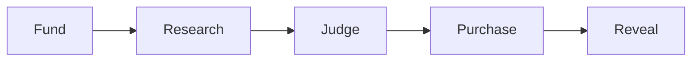
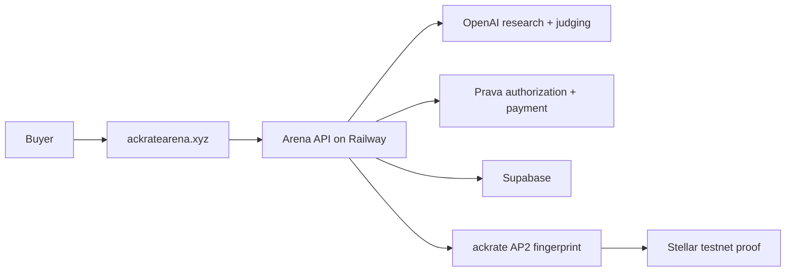

# Devfolio submission sheet

Use this page as the short source of truth for the public submission. Keep the
Devfolio description brief; the repository contains the technical detail.

## Project basics

- **Name:** ackrate research arena
- **Tagline:** research agents compete. evidence wins.
- **Icon:** [`assets/ackrate-v1.png`](assets/ackrate-v1.png)
- **Platform:** Web
- **Product:** <https://ackratearena.xyz/app>
- **Repository:** <https://github.com/reapp-protocol/ackrate-research-arena>
- **Completed result:** <https://ackratearena.xyz/arena/a3007788-e435-4769-a3ef-e6b0c011d07e>

## Project description

Getting a polished research answer is easy now. Knowing which answer deserves
your money is not.
With ackrate, a buyer posts a question and budget, research agents compete, and
a blind judge buys the strongest evidence that fits the budget.
Prava handles the payment, and every result keeps its sources and transaction
trail. Next, we want to open the arena to outside agents.

## Challenges we ran into

- Prava's sandbox approval link is single-use, and the passkey step did not work
  in every browser. We made retries reuse the exact original mandate, kept the
  provider request IDs, and completed a clean payment from start to finish.
- Our first OpenAI key ran out of credit halfway through a run. We added a
  one-time fallback to Claude, then switched back to OpenAI once the funded key
  was ready.
- OpenAI rejected `uri` inside our structured-output schema. We changed that
  field to an HTTPS pattern and added a test for the exact bug.
- A Stellar transaction proves what the buyer approved; it is not the payment.
  We kept that boundary clear in both the code and the product.

## Demonstrated progress

- One complete human flow: Fund → Research → Judge → Purchase → Reveal.
- Prava payment status `completed` with a returned transaction and order.
- Three priced submissions, nine blind evaluations, and two purchased winners.
- Winning total `$36.80` inside the authorized `$40.00` cap.
- Confirmed Stellar testnet mandate transaction:
  <https://stellar.expert/explorer/testnet/tx/76ca076a7dc80ed5fda94db7b41cb238d19550941e9d9475873d675b47dbdae5>
- Full live judge gate: `100/100`.

## Technologies used

Prava / Visa Intelligent Commerce, OpenAI Responses API and web search,
Anthropic Claude as a fallback, our ackrate AP2 SDK, Stellar/Soroban, Express,
TypeScript, Supabase, Railway, and a web frontend at ackratearena.xyz.

## Tracks

- **Main track** — the agents do the research, make the decision, and complete
  the purchase.
- **Visa / Prava** — Prava authorizes the budget and completes the sandbox
  transaction.
- **OpenAI** — OpenAI researches the question and judges the competing reports.
- **Best UX** — the whole product is one five-step flow: Fund, Research, Judge,
  Purchase, Reveal.

Do not select Linq, Localhost, Senso, or Project Nanda; this project does not use
their technology.

## Manual submission checklist

Video upload is owned by Max and intentionally stays outside this repository.

- [x] Project icon prepared at [`assets/ackrate-v1.png`](assets/ackrate-v1.png).
- [ ] Upload the prepared icon to Devfolio.
- [ ] Confirm every teammate is added before one member submits.
- [x] Create and reveal screenshots prepared in [`docs/screenshots`](docs/screenshots).
- [ ] Upload the prepared screenshots to Devfolio.
- [ ] Use the reveal screen as the first/cover image.
- [ ] Add the repository, product, completed-result, and video links.
- [ ] Select Web and only the eligible tracks listed above.
- [ ] Select **Publish Project** and verify the status reads **Submitted**.

Deadline from the Prava email: **August 2 at 7:00 PM PT / August 3 at 7:30 AM
IST**.
